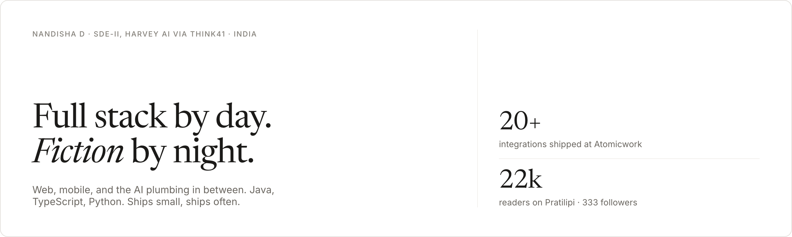
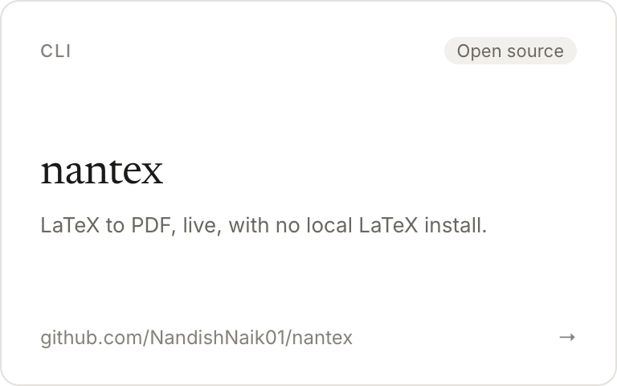
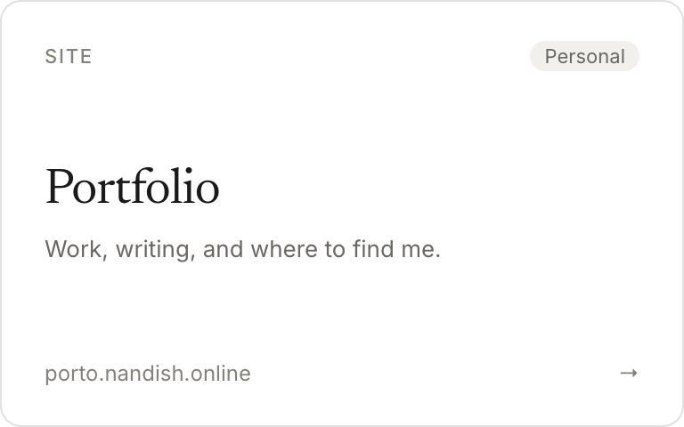

<a href="https://porto.nandish.online/"><picture><source media="(prefers-color-scheme: dark)" srcset="assets/header-dark.png"></picture></a>

## Featured

<table width="100%"><tr>
<td width="33%"><a href="https://autointerviewer.nandish.online/"><picture><source media="(prefers-color-scheme: dark)" srcset="assets/card-autointerviewer-dark.png"></picture></a></td>
<td width="33%"><a href="https://github.com/NandishNaik01/nantex"><picture><source media="(prefers-color-scheme: dark)" srcset="assets/card-nantex-dark.png"></picture></a></td>
<td width="33%"><a href="https://porto.nandish.online/"><picture><source media="(prefers-color-scheme: dark)" srcset="assets/card-portfolio-dark.png"></picture></a></td>
</tr></table>

Also contributing to [bearcove/arborium](https://github.com/bearcove/arborium).

## Stack

**Languages**  
    

**Frameworks**  
      

**Data**  
   

**Cloud & DevOps**  
     

**AI & Agentic**  
   

## Activity

<table width="100%"><tr>
<td width="50%" valign="top">

## Writing
Fiction on [Pratilipi](https://www.pratilipi.com) — 22k readers, 333 followers.

</td>
<td width="50%" valign="top">

## Education
- BE, Computer Science — JNNCE, 2024
- PUC (PCMB) — DVS (Ind) PU College, 2020
- SSLC — Govt School Gajnoor, 2018

</td>
</tr></table>

---
naik.nandishd@gmail.com · [porto.nandish.online](https://porto.nandish.online/)
